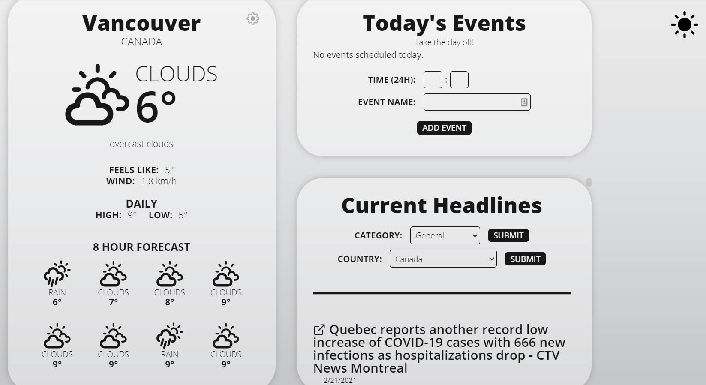

# Morning Refresher Website
A website designed to give you information and set up your day while you drink your morning coffee.

This website was created during BCHacks 2.0 for their 24 hour hackathon. We used the React.js library to create and format the site. [Openweathermap](https://nodejs.org/en/) and [newsapi](https://newsapi.org/) are used to get data for the weather and news compenents.

### Getting started

##### To run locally
Install npm through node.js [here](https://nodejs.org/en/).
Clone the repository
Run npm install to install all dependencies.
Run npm start from a terminal in the morning-refresher directory.

##### Sample Screenshot of the site

